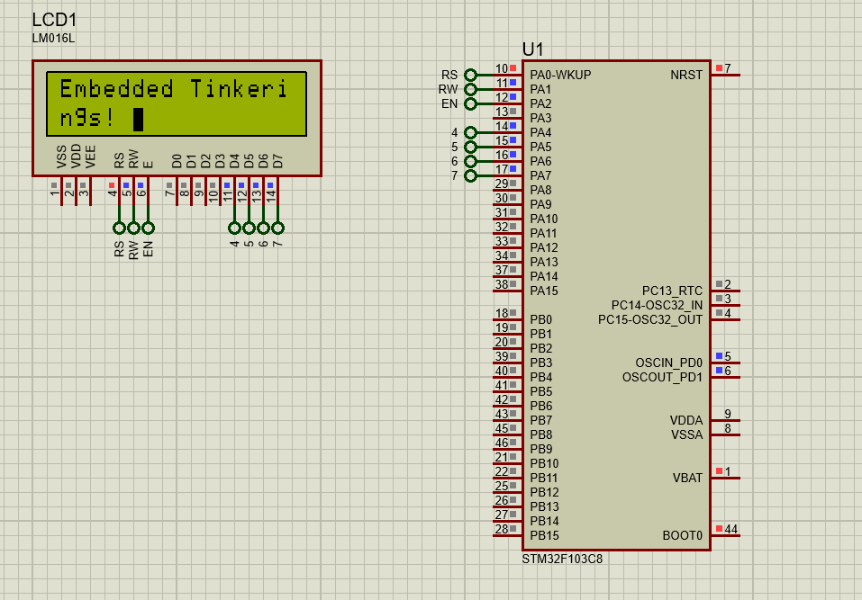

# Hitachi HD44780 LCD Interfacing

## Description

The Hitachi HD44780 is one of the most widely used controllers for character LCD modules, commonly found in sizes such as 16x2 or 20x4. These LCDs are popular in embedded systems for displaying alphanumeric characters and symbols, making them ideal for applications like user interfaces, data displays, and debugging.

In this project, the LCD is interfaced using the **4-bit mode**, which reduces the number of GPIO pins required by sending data in two 4-bit nibbles instead of one 8-bit byte. The **busy flag** is checked to ensure the LCD is ready before sending the next command or data, providing precise timing control and eliminating unnecessary delays.

## Handling Command Execution Time

Each command sent to the LCD has a specific execution time during which the LCD processes the instruction. To ensure proper operation:
1. **Busy Flag Check**: The busy flag (DB7 pin) is monitored to determine when the LCD is ready for the next instruction.  
   This avoids relying on fixed delays and allows efficient use of processing time.

## Key Tasks for Interfacing

1. **Initialization**:
   - Configure the LCD in **4-bit mode** and set the display parameters (e.g., cursor behavior, display on/off).
2. **Sending Commands**:
   - Control the LCD using commands for tasks such as clearing the display, moving the cursor, or toggling display features.
3. **Displaying Data**:
   - Send characters or strings to be displayed on the screen, either sequentially or by positioning the cursor first.

## Demonstration

### Screenshot

