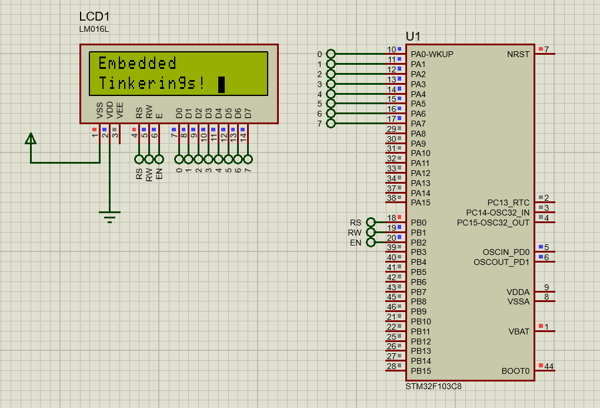

# Hitachi HD44780 LCD Interfacing

## Description

The Hitachi HD44780 is one of the most widely used controllers for character LCD modules, commonly found in sizes such as 16x2 or 20x4. These LCDs are popular in embedded systems for displaying alphanumeric characters and symbols, making them ideal for applications like user interfaces, data displays, and debugging.

Interfacing with the HD44780 involves sending commands and data via its parallel interface, which can be operated in either **4-bit mode** or **8-bit mode**. In this project, the **8-bit mode** is used to take advantage of faster data transfer by utilizing all 8 data lines.

### Handling Command Execution Time
Each command sent to the LCD has a maximum execution time, during which the LCD processes the instruction. To ensure reliable operation, you must wait for the LCD to be ready before sending the next command or data. In this project, this is achieved by **applying delays** based on the maximum execution time of each command.

### Key Tasks for Interfacing
1. **Initialization**:
   - Configure the LCD in the desired mode (**8-bit mode** in this project) and set display parameters (e.g., cursor behavior, display on/off).
2. **Sending Commands**:
   - Control the display using commands for tasks like clearing the screen, moving the cursor, or toggling display features.
3. **Displaying Data**:
   - Send characters or strings to be displayed on the screen, either row by row or by positioning the cursor first.

## Results and Demonstration

Below is a preview of the simulation:

## Screenshot

