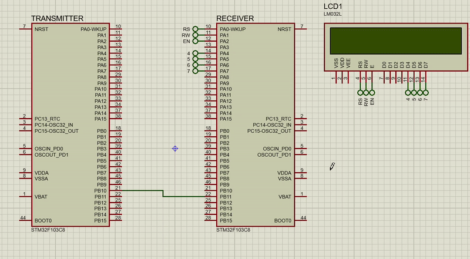

# USART Communication: Transmitter and Receiver

## Description

This project demonstrates bidirectional communication between two STM32 microcontrollers using the **USART (Universal Synchronous/Asynchronous Receiver-Transmitter)** protocol. The project consists of two parts:

1. **Transmitter**: Sends data over USART to the receiver.
2. **Receiver**: Receives the transmitted data and displays it on an **HD44780 LCD**.

USART is configured in asynchronous mode, enabling full-duplex communication without the need for a clock signal.

---

## Transmitter Side

The transmitter microcontroller sends a predefined string or data over USART. It is configured with the following settings:
- **Baud Rate**: 9600 bps
- **Data Bits**: 8
- **Parity**: None
- **Stop Bits**: 1

### Key Tasks:
1. **Initialize USART**: Configure USART registers for asynchronous communication.
2. **Transmit Data**: Send data byte-by-byte using polling.

---

## Receiver Side

The receiver microcontroller reads data transmitted by the transmitter via USART and displays it on an **HD44780 LCD**. 

### Key Tasks:
1. **Initialize USART**: Configure USART registers to match the transmitter's settings.
2. **Receive Data**: Continuously read incoming data from the USART data register.
3. **Display Data**:
   - Use the HD44780 LCD module to display the received string.

### LCD Integration:
- The LCD is configured in **4-bit mode** to minimize GPIO usage.

## Results 

