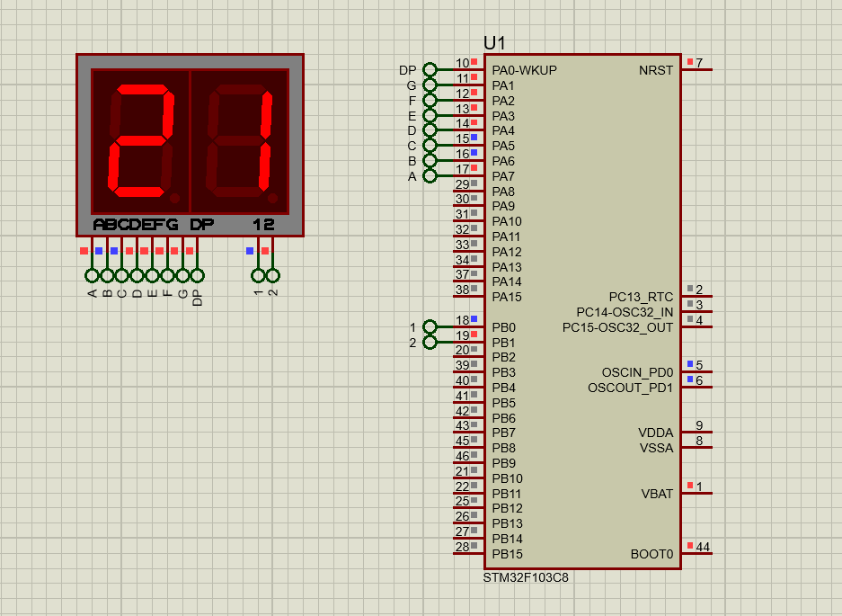
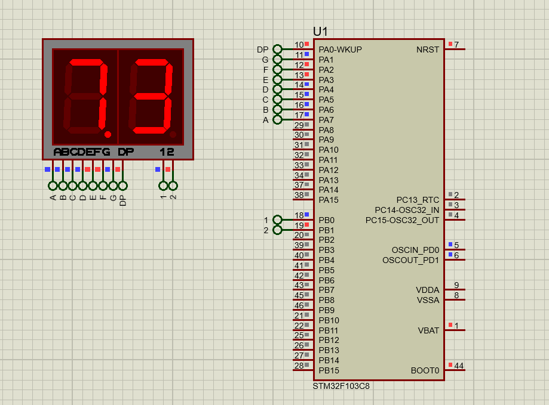

# Double Seven-segment

## Description
When working with multiple seven-segment displays, multiplexing is commonly used to control them efficiently. Since the input pins are shared across the displays, it is not possible to display different values simultaneously without interference. To overcome this, you enable only one seven-segment display at a time while disabling the others. This process happens rapidly enough that all displays appear to be lit simultaneously to the human eye due to persistence of vision.

## Simulation Results

