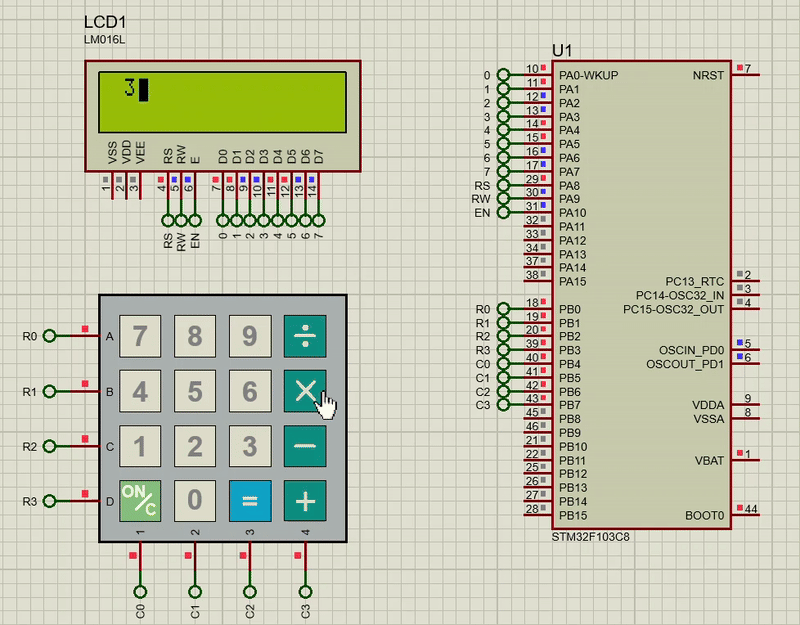

# Keyboard Interfacing with LCD

## Description

This project demonstrates how to interface a **4x4 matrix keyboard** with an STM32 microcontroller and display the pressed key on an **HD44780 LCD**. When a key is pressed on the keyboard, its corresponding value is displayed on the LCD in real-time.

## Keyboard Interfacing

### Keypad Layout

The 4x4 matrix keyboard consists of 16 keys arranged in 4 rows and 4 columns.

### Keypad Scanning

To detect key presses, the STM32 microcontroller sequentially drives each row of the matrix and reads the columns. When a key is pressed, a row-column combination is activated, and the microcontroller identifies the corresponding key based on the active row and column.

- **Row scanning**: The microcontroller sets each row high, one at a time, and checks which column is active.
- **Column detection**: By checking which column has a low signal when a row is set high, the microcontroller identifies the key pressed.

### Debouncing

To prevent multiple detections of the same key press, a simple delay is applied. This ensures that each key press is only registered once, even if the physical switch bounces during activation.

## LCD Output

After detecting the key press, the corresponding value is sent to the **HD44780 LCD**, which displays the pressed key. The LCD is controlled in **8-bit mode**, and the **busy flag** is checked before sending the next character, ensuring reliable data transfer.

## Demonstration

### Screenshot
Here’s an example of the LCD displaying the pressed key:

