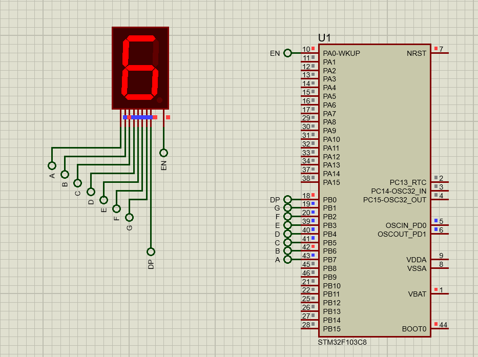

# Common Anode Seven-Segment Interfacing

## Description

This project demonstrates how to interface a **single common anode seven-segment display** with an STM32 microcontroller. The seven-segment is used to display numeric digits (0-9) by controlling its segments through GPIO pins. 

The microcontroller sends the appropriate signals to light up the segments corresponding to the desired digit.

## How It Works

1. **Common Anode Configuration**:
   - The common anode pin is connected to a fixed high voltage (VCC).

2. **Digit Display**:
   - To display a number, the microcontroller sets the corresponding segments to LOW (active state for common anode configuration).
   - For example, to display "8," all segments are activated.

3. **Code Implementation**:
   - The GPIO pins are configured as output.
   - A simple lookup table or an array is used to map digits (0-9) to their corresponding segment patterns.

## Demonstration

### Screenshot
